# Matrix calculator for two by two and three by three real matrices

## Description

This program is a console application that can add, multiply and invert 2 by 2 and 3 by 3 real matrices. 
It has error checking and it keeps runnig until the user quits.

### Usage

First, you need to compile the cpp files using a c++ compiler (I am using the [gcc](https://gcc.gnu.org) compiler) then you link both files to create an executable. 
This is done like so on a linux system:

1. Compiling **matrix.cpp**: `g++ -c matrix.cpp`
2. Compiling **main.cpp**: `g++ -c main.cpp`
3. Linking into **matrix**: `g++ -o matrix matrix.o main.o`
4. Execution: `./matrix`

### Demonstration

We will see a few examples of how to use this application.

After execution you are presented with the following list

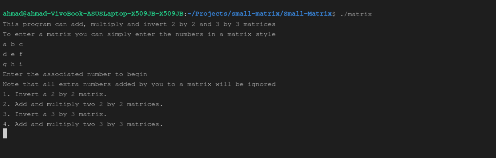

You have to simply enter the number associated to begin (type the number then click enter).

#### Adding and Multiplying Two Matrices

We want to have the sum and multiplication of these two matrices:

 and .

Therefore we choose number 2.

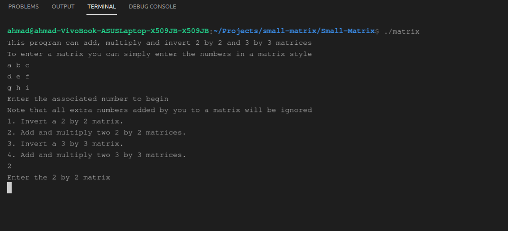

As you can see the program is asking to enter the two by two matrix, doing so is straightforward.
You can simply enter the matrix like so: 

1 2
3 4

after you're done click enter.

Here's a picture

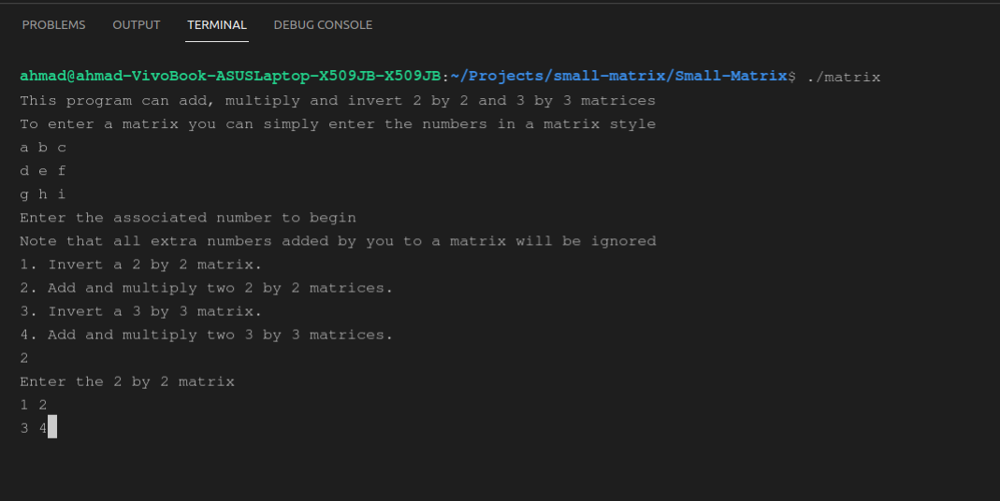

Once you entered the first matrix, the second one is asked automatically

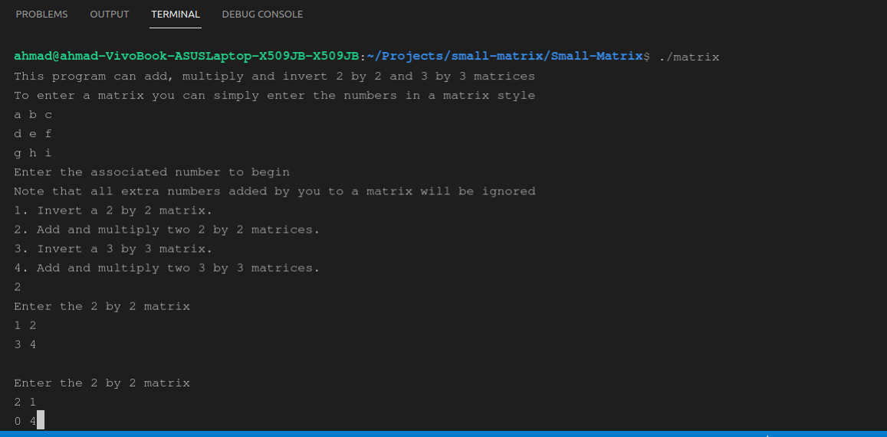

After you enter the second matrix, you will be prompted with the sum and the product

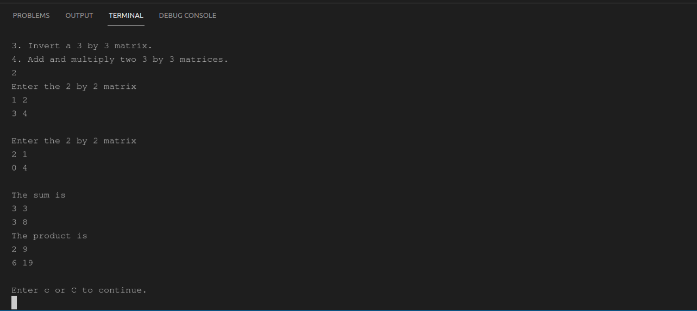

You can see that at the end of the terminal we have the option of entering 'c' to continue, doing so will get you
back to the list

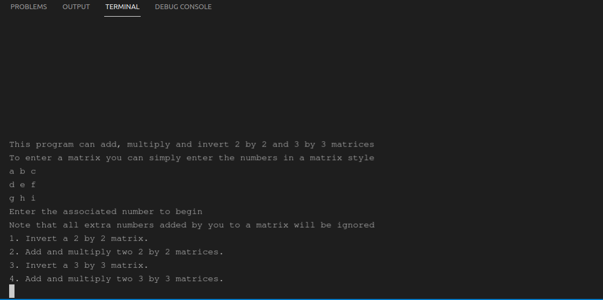

The empty space that you can see at the top is inserted to avoid confusion when using the application.
You can scroll up to see your previous results.

Adding and multiplying two three by three matrices is quite similar.

#### Inverse of a Three By Three Matrix

Let's see how to get the inverse of a three by three matrix, we want the inverse of

First, we choose the option number 3, then we enter the matrix.

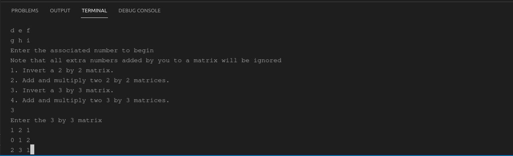

Once you click enter after typing the last number, you get the result

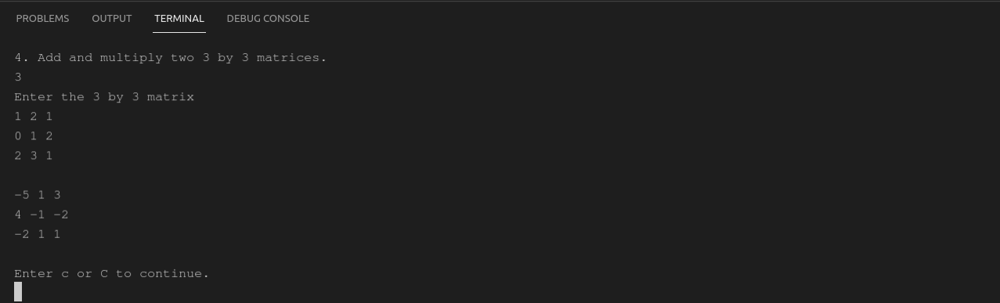

Let's see what happens when we have a noninvertible matrix

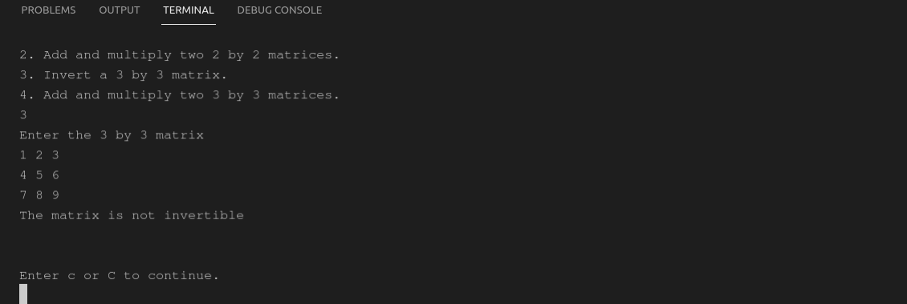

The sentence "The matrix is not invertible" is printed and you can continue by entering "c".

### Error handling

This application will prompt the user in case a wrong input is provided.

Suppose we want to know the sum and product of 

 and 

However, when entering the values the user makes a typo and enters the letter "s" insted of 0.5.

First matrix is entered successfully

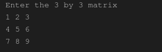

A typo is made when entering the second matrix (the letter "s" is entered instead of a number)

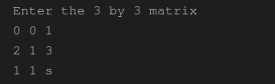

Once you enter this matrix you will be prompted with an error message, and you will be asked to enter the matrix once again

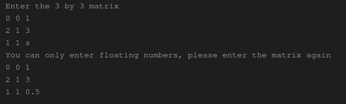

The result will be displayed immediately after providing the corrected matrix.

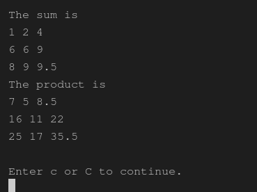